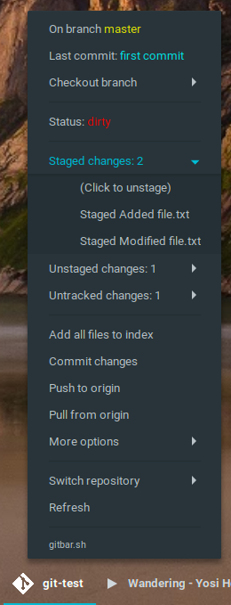

# gitbar
Argos/BitBar plugin to manage git repositories quickly and easily through a simple menu system GUI.

## Usage:
Download either [Argos for Gnome Shell](https://github.com/p-e-w/argos) or [BitBar for Mac OS](https://getbitbar.com/) (I haven't seen anything similar for Windows, but please let me know if you do see something!). Then, install this shell script as a plugin. By default, gitbar searches your home directory for `.git` directories. Modifying this directory is as simple as modifying the `find` call near the bottom.

## Screenshots:

## Contributing:
Feel free to send a pull request with any changes!
